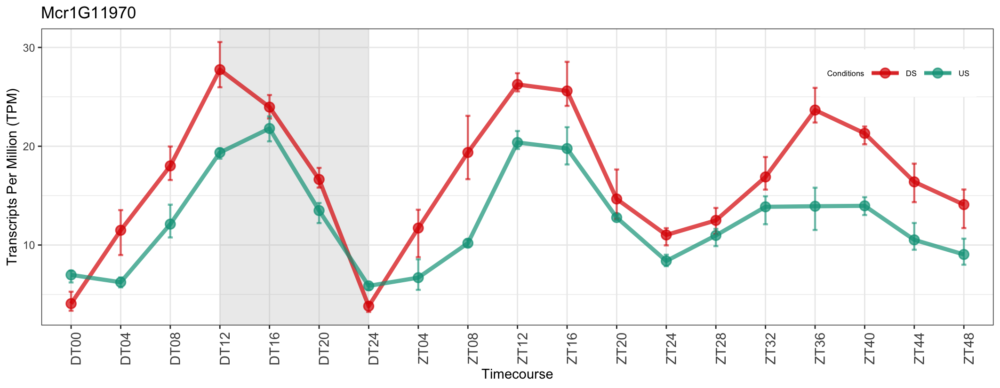
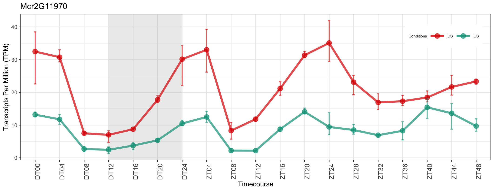

# Ice plant transcriptome profiling tool
This repository provides a plotting tool for 72-hour time-course transcriptome profiling data of unstressed and drought stressed ice plant (*Mesembryanthemum crystallinum*). The experiment includes 24-hours of diel time followed by 48-hours of zeitgeber time with sampling every 4 hours. The provided data are in transcripts per million (TPM). The tool outputs a single plot (PNG) of the expression profile of the queried gene ID.

## Prerequisite
 - [R](https://cloud.r-project.org/) >= 4.0.0:
 - [Git](https://github.com/git-guides/install-git)

## Library requirement
**below packages will be installed automatically:**
- ggplot2
- plyr
- Hmisc
- extrafont
- gridExtra
- ggsci
- data.table
- dplyr

## Downloading data
Using the terminal, navigate to the folder you want to save the bot in your machine.
1. Open the terminal
2. Navigate to the folder using commands such as `cd` 
- For example: `cd Documents`
3. Once you are in the desired folder for your bot run below command: 
```bash
git clone git@github.com:plantgenomicslab/Ice-plant-transcriptome-profiling.git
```

## Using the tool
To run the tool, you must navigate inside the cloned repository such as `cd Ice-plant-transcriptome-profiling`. 
After running below command you will see a new PNG file titled with the ice plant gene ID that you queried.

### Usage :
```
Rscript plot_iceplant_expression.r [gene_id]
```
### For Example:
```
Rscript plot_iceplant_expression.r Mcr1G11970
```
## Open file
### WSL
```
explorer.exe .
```
### MacOS
```
open .
```
### Linux
```
xdg-open .
```
Or 
```
gnome-open .
```
Or
```
nautilus .
```
## Output 





## Batch processing

### Usage :
```
for i in [gene_id] [gene_id] [gene_id] [gene_id] ....
 do
  Rscript plot_iceplant_expression.R $i  &
 done
```
### For Example:
```
for i in Mcr1G11970 Mcr1G12970 Mcr2G11970
 do
  Rscript plot_iceplant_expression.R $i &
 done
```

